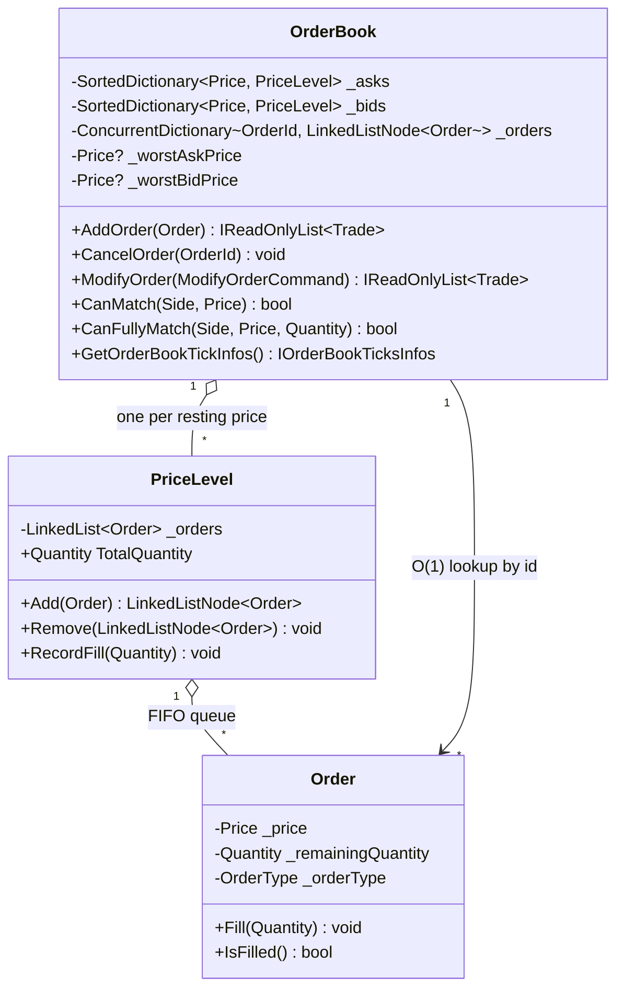
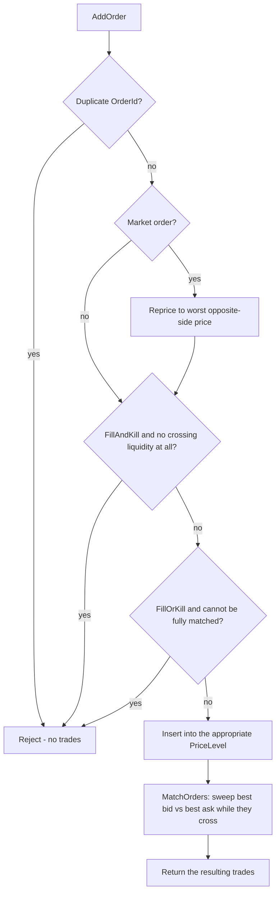

# Order Book

A single-instrument, price-time-priority limit order matching engine, built from scratch in C# / .NET. No frameworks, no external matching libraries , just the data structures, concurrency model, and order-type semantics that sit at the core of every electronic exchange.

This project exists to explore a genuinely interesting systems problem: an order book has to stay correct under concurrent mutation, support several distinct order-type semantics (limit, market, IOC, FOK, day orders), and do all of it fast, since matching latency is directly on the critical path of the system it belongs to.

## Table of contents

- [Order Book](#order-book)
  - [Table of contents](#table-of-contents)
  - [Order types](#order-types)
  - [Architecture](#architecture)
    - [Data structures](#data-structures)
    - [Complexity](#complexity)
    - [Matching workflow](#matching-workflow)
    - [Concurrency model](#concurrency-model)
  - [Design decisions worth calling out](#design-decisions-worth-calling-out)
  - [Testing](#testing)
  - [Getting started](#getting-started)
  - [Project structure](#project-structure)
  - [Potential improvements](#potential-improvements)
    - [Tier 2 , cache-friendlier data structures](#tier-2--cache-friendlier-data-structures)
    - [Tier 3 , lock-free, single-writer ingestion](#tier-3--lock-free-single-writer-ingestion)
    - [Other extensions](#other-extensions)

## Order types

| Order type | Semantics | Industry equivalent |
|---|---|---|
| `GoodTillCancel` | Rests on the book until it's fully filled or explicitly cancelled | GTC |
| `Market` | Reprices itself to the worst currently-available price on the opposite side and sweeps the book from best to worst; any unfilled remainder rests at that price | Market order |
| `FillAndKill` | Executes whatever liquidity is immediately available; any unfilled remainder is cancelled instead of resting | IOC (Immediate-or-Cancel) |
| `FillOrKill` | All-or-nothing , only executes if the *entire* quantity can be matched immediately (checked up front across every qualifying price level); otherwise the order is rejected outright with no partial fill | FOK (Fill-or-Kill) |
| `GoodForDay` | Behaves like GTC while resting, but is automatically cancelled at midnight if it's still unfilled | GFD / Day order |

Matching itself follows standard **price-time priority**: at any given price level, orders are filled strictly in the order they arrived (FIFO); across price levels, the best price is always matched first.

## Architecture

### Data structures



The book is two independent price ladders, one per side:

- **`_bids` / `_asks`: `SortedDictionary<Price, PriceLevel>`.** Each distinct resting price maps to a `PriceLevel`. `_asks` sorts ascending (best/lowest ask first); `_bids` sorts descending via a custom comparer (best/highest bid first) , so `.First()` on either side is always "the best price," without a separate best-price pointer to keep in sync.
- **`PriceLevel`: `LinkedList<Order>` + a running `TotalQuantity`.** The linked list gives O(1) FIFO append/pop for price-time priority within a level. The aggregate quantity is updated incrementally in the same three places the order list itself is mutated (`Add`, `Remove`, `RecordFill`) , it used to live in a separate dictionary keyed by price, which meant every mutation touched two data structures that could (and did , see [Testing](#testing)) drift out of sync. Folding it into `PriceLevel` means there is exactly one place that tracks it.
- **`_orders`: `ConcurrentDictionary<OrderId, LinkedListNode<Order>>`.** O(1) average lookup from an order ID straight to its list node, so cancelling a specific order doesn't require scanning a price level. It's a `ConcurrentDictionary` (rather than a plain `Dictionary`, even though every mutation already happens under a lock) specifically so `GetOrderCount()` and the GoodForDay pruning scan can read it *without* taking the matching-engine lock.
- **`_worstAskPrice` / `_worstBidPrice`: cached `Price?` fields.** `SortedDictionary` has no built-in O(log n) `Max`/`Min` the way `SortedSet` does, and a naive `_asks.Last()` is a full O(L) walk (LINQ's `Last()` can't seek backward through a tree enumerator , it has to exhaust it). Since Market orders need the worst opposite-side price to reprice against, these two fields are maintained incrementally by the only two code paths that create or remove a price level, turning an O(L)-on-every-Market-order operation into an O(1) one (with a bounded, rare O(L) recompute only when the *cached* worst level itself is removed).

### Complexity

_L = number of distinct resting price levels on the relevant side (not order count , many orders can share one level for O(1) extra cost each)._

| Operation | Complexity | Why |
|---|---|---|
| Add order, existing price level | O(log L) | `SortedDictionary` lookup, then O(1) list append |
| Add order, new price level | O(log L) | tree insert |
| Cancel order | O(log L) amortized | O(1) order lookup, O(1) node removal, O(log L) level lookup/removal |
| Best bid / best ask (`CanMatch`) | O(log L) | `.First()` descends to the tree's leftmost node |
| `CanFullyMatch` | O(k), k ≤ L | walks only the qualifying levels, in sorted order, and stops early |
| Match one crossing pair | O(1) amortized | per unit of work per fill |
| Full order book snapshot | O(L) | one `TotalQuantity` read per level , no re-summing orders |

### Matching workflow



`MatchOrders` is a single, generic sweep: repeatedly take the best bid and best ask, and if they cross, drain orders FIFO from both sides , filling fully where possible, partially otherwise , until either side stops crossing or one of the levels empties out, cleaning up exhausted price levels as it goes. Every public mutation (`AddOrder`, `CancelOrder`, `ModifyOrder`) funnels through this one method, so there's a single, well-tested implementation of price-time priority rather than one per call site. `ModifyOrder` itself is just `CancelOrder` + `AddOrder` under one lock acquisition (cancel-replace, not an in-place price/quantity mutation) , simpler to reason about, at the cost of losing queue priority on modification, which matches how most real venues treat a price change anyway.

### Concurrency model

A single reentrant `Monitor` lock (`_mutex`) guards every mutation of `_asks`/`_bids`/`_worstAskPrice`/`_worstBidPrice`. This is deliberately the simplest correct option, not the fastest one , see [Potential improvements](#potential-improvements) for the lock-free path. Reentrancy matters because the public API calls into itself under lock (`AddOrder` → `MatchOrders`, `ModifyOrder` → `CancelOrder` + `AddOrder`, the GoodForDay pruner batching many `CancelOrder` calls under one lock acquisition instead of one per order).

GoodForDay pruning is driven by a [`TimeProvider`](https://learn.microsoft.com/en-us/dotnet/api/system.timeprovider)-created `ITimer` rather than a dedicated OS thread polling `DateTime.Now`. Two things fall out of that: production code uses the real system clock and pays essentially nothing for an idle timer, while tests inject a `FakeTimeProvider` and jump straight past a simulated midnight , no dedicated thread, no real waiting, and no per-`OrderBook`-instance OS thread to pay for if this ever needs to scale to many instruments.

## Design decisions worth calling out

- **`Price` wraps `decimal`, not `double`.** Binary floating point can't represent most decimal fractions exactly, which is a well-known source of off-by-a-cent bugs in financial code; `decimal` is base-10 and exact for the values that actually show up in prices.
- **Immutable-by-convention domain primitives.** `Price`, `Quantity`, and `OrderId` are `readonly record struct`s , value equality, no accidental aliasing, no boxing on comparison.
- **`Order` hides its state behind getters, not public properties**, and mutation is limited to a single `Fill(Quantity)` method that enforces the invariant that you can never fill more than what's remaining. There's exactly one way to change an order's remaining quantity, and it's the one place that's validated.
- **`Trade` and `TradeInfo` are `readonly record struct`s**, not classes , a matching burst can produce a lot of trades, and there's no reason to heap-allocate each one when a struct fits in a `List<Trade>`'s backing array directly.

## Testing

49 xUnit tests across the domain types, `Order`, and the order book itself , deliberately not just the happy path. Coverage includes price-time priority (FIFO within a level, best-price-first across levels), partial fills, multi-level sweeps, every order type's edge cases (FOK's all-or-nothing rejection, IOC's "cancel the unfilled remainder" behavior, Market orders with and without opposite-side liquidity), duplicate/nonexistent order IDs, and the GoodForDay midnight-pruning timer via an injected `FakeTimeProvider`.

Writing this suite wasn't just a coverage exercise , it caught real, previously-unnoticed bugs in the matching engine, including:

- An **infinite loop** in `MatchOrders`: exhausted price levels weren't removed from the tree until after the entire matching sweep finished, so the sweep kept re-selecting an empty level forever whenever an order crossed more than one price level.
- `CancelOrder` **silently no-op'ing** on every call, because the order index stored a freshly-constructed, disconnected `LinkedListNode` instead of the one actually inserted into the price level's list.
- A missing `else` branch that meant a price level's aggregate quantity was **never initialized on its first order**, which made `FillOrKill` orders reject unconditionally regardless of actual available liquidity.
- An `IComparable`-related crash the instant a second distinct ask price existed, because `_asks` (unlike `_bids`) was constructed without an explicit comparer.

Each of those has a regression test named after the behavior it guards, not the bug , so the suite documents intended behavior first and incidentally prevents regressions, rather than the other way around.

## Getting started

```bash
git clone https://github.com/angur001/Order-Book-in-C-sharp.git
cd Order-Book-in-C-sharp

dotnet build OrderBook.slnx
dotnet test OrderBook.slnx
dotnet run --project "Order Book"
```

Requires the .NET 10 SDK.

## Project structure

```
Order Book/
├── OrderBook.cs                 # the matching engine itself
├── DomainTypes.cs                # Price, Quantity, OrderId
├── classes/
│   ├── Order.cs
│   └── PriceLevel.cs
├── enums/
│   ├── OrderType.cs
│   └── Side.cs
├── OrderCommands/
│   └── ModifyOrderCommand.cs
├── Trade/
│   ├── Trade.cs
│   └── TradeInfo.cs
├── structs/
│   └── Tick.cs
└── interfaces/
    └── IOrderBookTicksInfos.cs

OrderBook.Tests/                  # xUnit test suite (49 tests)
```

## Potential improvements

Two further tiers of change were scoped out but deliberately not implemented yet, since they trade simplicity for raw performance and this project prioritized a correct, well-tested, readable engine first.

### Tier 2 , cache-friendlier data structures

`SortedDictionary` (a red-black tree) plus a `LinkedList` per level means every resting order costs 2-3 separate pointer-chasing heap allocations, and every new or emptied price level costs an O(log L) tree rebalance. Real markets trade on a fixed tick grid, which opens the door to an **array- or ring-buffer-indexed price ladder** , `index = (price - minPrice) / tickSize` , giving O(1) level access and dramatically better cache locality than tree traversal, at the cost of needing to size/handle the price range up front. This is the single highest-leverage change for raw per-operation latency.

### Tier 3 , lock-free, single-writer ingestion

The current design serializes every operation behind one `Monitor` lock. The standard high-performance answer (the [LMAX Disruptor](https://lmax-exchange.github.io/disruptor/) pattern, used by real exchanges) is a **single-writer architecture**: one dedicated thread exclusively owns all book mutations, fed by a lock-free ring buffer, so the hot path never takes a lock at all. This is the biggest possible win for tail latency under contention, but it's a genuine architecture change , order submission becomes enqueue-then-notify instead of a synchronous call that returns trades directly, and testing needs deterministic draining instead of just calling a method and asserting on the return value. Worth doing if this ever needs to process real concurrent load; overkill for a single-threaded caller today.

### Other extensions

- **Benchmarking.** A [BenchmarkDotNet](https://benchmarkdotnet.org/) suite to actually measure the Tier 2/3 gains instead of reasoning about them asymptotically.
- **Multi-instrument support.** Today's `OrderBook` is one instrument; a matching engine service would own a book per symbol.
- **Market data dissemination.** `GetOrderBookTickInfos()` is pull-based; a real venue would push incremental book-depth updates to subscribers.
- **Persistence / event sourcing.** Orders and trades live in memory only , no crash recovery, no replay.
- **Risk checks and tick/lot-size validation** at the gateway, before an order ever reaches the matching engine.
