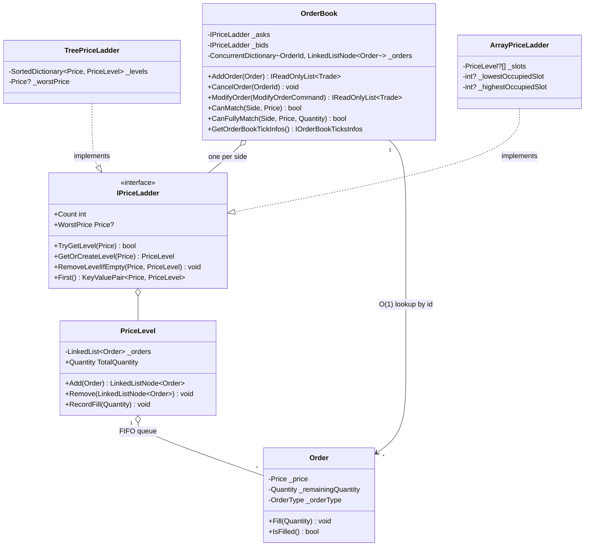
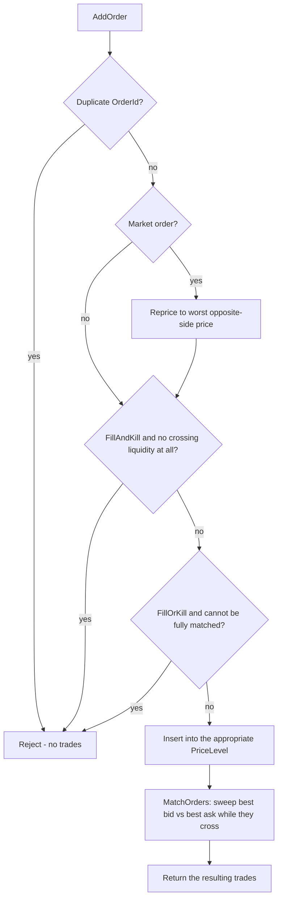

# Order Book


A single-instrument, price-time-priority limit order matching engine, built from scratch in C# / .NET. No frameworks, no external matching libraries - just the data structures, concurrency model, and order-type semantics that sit at the core of every electronic exchange.

This project exists to explore a genuinely interesting systems problem: an order book has to stay correct under concurrent mutation, support several distinct order-type semantics (limit, market, IOC, FOK, day orders), and do all of it fast, since matching latency is directly on the critical path of the system it belongs to.

## Highlights

*For reviewers short on time - each point links to the section that backs it up.*

- **Price-time priority matching engine** supporting 5 order types (GTC, Market, IOC, FOK, GFD) with the FIFO-within-level, best-price-first-across-levels guarantees real venues use. See [Order types](#order-types).
- **Two interchangeable price-ladder strategies** - a red-black tree and a tick-indexed array - behind a Strategy-pattern interface, compared head-to-head with real [BenchmarkDotNet](https://benchmarkdotnet.org/) numbers, not just asymptotic claims. See [Benchmark results](#benchmark-results).
- **86 xUnit tests**, deliberately not just the happy path - including regression tests for real bugs the suite caught during development. See [Testing](#testing).
- **GC-conscious under measurement**: object pooling on the hottest churn path was verified with a dedicated allocation benchmark, not assumed. See [Object pooling](#object-pooling-for-pricelevel).
- **Correct under concurrent mutation**: every book mutation funnels through one reentrant lock - the simplest correct design, with the lock-free single-writer alternative explicitly scoped as a next step. See [Concurrency model](#concurrency-model).
- **Zero external dependencies** - the matching engine itself is pure C# standard library, no third-party packages.

## Table of contents

- [Order Book](#order-book)
  - [Highlights](#highlights)
  - [Table of contents](#table-of-contents)
  - [Order types](#order-types)
  - [Getting started](#getting-started)
  - [Architecture](#architecture)
    - [Data structures](#data-structures)
    - [Pluggable price-ladder strategy (Strategy pattern)](#pluggable-price-ladder-strategy-strategy-pattern)
    - [Complexity](#complexity)
    - [Benchmark results](#benchmark-results)
    - [Matching workflow](#matching-workflow)
    - [Concurrency model](#concurrency-model)
  - [Design decisions worth calling out](#design-decisions-worth-calling-out)
  - [Testing](#testing)
  - [Project structure](#project-structure)
  - [Potential improvements](#potential-improvements)
    - [Tier 2 - cache-friendlier data structures](#tier-2---cache-friendlier-data-structures)
    - [Object pooling for `PriceLevel`](#object-pooling-for-pricelevel)
    - [Tier 3 - lock-free, single-writer ingestion](#tier-3---lock-free-single-writer-ingestion)
    - [Other extensions](#other-extensions)

## Order types

| Order type | Semantics | Industry equivalent |
|---|---|---|
| `GoodTillCancel` | Rests on the book until it's fully filled or explicitly cancelled | GTC |
| `Market` | Reprices itself to the worst currently-available price on the opposite side and sweeps the book from best to worst; any unfilled remainder rests at that price | Market order |
| `FillAndKill` | Executes whatever liquidity is immediately available; any unfilled remainder is cancelled instead of resting | IOC (Immediate-or-Cancel) |
| `FillOrKill` | All-or-nothing - only executes if the *entire* quantity can be matched immediately (checked up front across every qualifying price level); otherwise the order is rejected outright with no partial fill | FOK (Fill-or-Kill) |
| `GoodForDay` | Behaves like GTC while resting, but is automatically cancelled at midnight if it's still unfilled | GFD / Day order |

Matching itself follows standard **price-time priority**: at any given price level, orders are filled strictly in the order they arrived (FIFO); across price levels, the best price is always matched first.

## Getting started

Requires the [.NET 10 SDK](https://dotnet.microsoft.com/download).

```bash
git clone https://github.com/angur001/Order-Book-in-C-sharp.git
cd Order-Book-in-C-sharp

dotnet build OrderBook.slnx
dotnet test OrderBook.slnx                              # 86 tests
dotnet run --project "Order Book"
dotnet run -c Release --project OrderBook.Benchmarks     # see Benchmark results
```

**Minimal usage** - rest a sell order, cross it with a buy, and read back the trade it produces:

```csharp
using var book = new OrderBook.OrderBook();

book.AddOrder(new Order(new OrderId(1), new Price(100.00m), new Quantity(10), Side.Sell, OrderType.GoodTillCancel));
var trades = book.AddOrder(new Order(new OrderId(2), new Price(100.00m), new Quantity(10), Side.Buy, OrderType.GoodTillCancel));

foreach (var trade in trades)
    Console.WriteLine($"{trade.GetBidTrade().quantity} @ {trade.GetBidTrade().price}"); // 10 @ 100.00
```

See [Order types](#order-types) for the full set of semantics and [Architecture](#architecture) below for how `AddOrder` turns into that trade under the hood.

## Architecture

### Data structures



The book is two independent price ladders, one per side:

- **`_bids` / `_asks`: `IPriceLadder`.** Each side is an ordered collection of `PriceLevel`s, always enumerated from best to worst; what "best"/"worst" mean is entirely up to whatever `IComparer<Price>` the ladder was built with, so `OrderBook` never hardcodes ascending/descending logic itself. See [Pluggable price-ladder strategy](#pluggable-price-ladder-strategy-strategy-pattern) below for why this is an interface rather than a concrete type, and for the two implementations that currently sit behind it.
- **`TreePriceLadder`: the default `IPriceLadder`.** A `SortedDictionary` (red-black tree) keyed by price, ordered by its comparer, so `.First()` on either side is always "the best price" without a separate best-price pointer to keep in sync. It also owns a cached `Price? _worstPrice`: `SortedDictionary` has no built-in O(log n) `Max`/`Min` the way `SortedSet` does, and a naive "last element" lookup is a full O(L) walk (LINQ's `Last()` can't seek backward through a tree enumerator, it has to exhaust it). Since Market orders need the worst opposite-side price to reprice against, this field is maintained incrementally by the only two methods that create or remove a price level, turning an O(L)-on-every-Market-order operation into an O(1) one (with a bounded, rare O(L) recompute only when the level removed was itself the cached worst).
- **`ArrayPriceLadder`: the Tier 2 `IPriceLadder`.** A tick-indexed array (`index = (price - minPrice) / tickSize`) instead of a tree - see [Tier 2](#tier-2---cache-friendlier-data-structures) for the full trade-off.
- **`PriceLevel`: `LinkedList<Order>` + a running `TotalQuantity`.** The linked list gives O(1) FIFO append/pop for price-time priority within a level. The aggregate quantity is updated incrementally in the same three places the order list itself is mutated (`Add`, `Remove`, `RecordFill`) - it used to live in a separate dictionary keyed by price, which meant every mutation touched two data structures that could (and did - see [Testing](#testing)) drift out of sync. Folding it into `PriceLevel` means there is exactly one place that tracks it.
- **`_orders`: `ConcurrentDictionary<OrderId, LinkedListNode<Order>>`.** O(1) average lookup from an order ID straight to its list node, so cancelling a specific order doesn't require scanning a price level. It's a `ConcurrentDictionary` (rather than a plain `Dictionary`, even though every mutation already happens under a lock) specifically so `GetOrderCount()` and the GoodForDay pruning scan can read it *without* taking the matching-engine lock.

### Pluggable price-ladder strategy (Strategy pattern)

`OrderBook` depends only on `IPriceLadder`, never on a concrete ladder type directly - which implementation each side gets is decided once, at construction time:

```csharp
public OrderBook(TimeProvider timeProvider, Func<IComparer<Price>, IPriceLadder> priceLadderFactory)
```

The factory is handed a "best-first" comparer and called once per side, so bids and asks always share the same strategy. `new OrderBook()` and `new OrderBook(timeProvider)` both default to `TreePriceLadder`; nothing about `AddOrder`, `CancelOrder`, `MatchOrders`, or any other matching logic knows or cares which concrete ladder it's driving. Two implementations sit behind the interface today - `TreePriceLadder` (the general-purpose default) and `ArrayPriceLadder` (the [Tier 2](#tier-2---cache-friendlier-data-structures) strategy) - and swapping between them (or adding a third) never touches `OrderBook` itself:

```csharp
using var treeBackedBook = new OrderBook.OrderBook(); // default: TreePriceLadder

using var arrayBackedBook = new OrderBook.OrderBook(
    TimeProvider.System,
    comparer => new ArrayPriceLadder(comparer, minPrice: new Price(0m), maxPrice: new Price(10_000m), tickSize: 0.01m));
```

`PriceLadderContractTests` is an abstract base class written entirely against `IPriceLadder`, with `TreePriceLadderTests` and `ArrayPriceLadderTests` each supplying just two factory methods - so both implementations run through the *same* behavioral test suite (best/worst tracking, cache-recompute-on-removal, enumeration order, and so on) as proof they're actually interchangeable, not just independently self-consistent. `OrderBookTests` goes one step further with an `ArrayPriceLadder`-configured `OrderBook` running a real multi-level match end-to-end, plus a separate spy-`IPriceLadder` test proving `OrderBook` genuinely drives whatever strategy it's given rather than silently depending on the default.

### Complexity

_L = number of distinct resting price levels on the relevant side (not order count - many orders can share one level for O(1) extra cost each). C = the array ladder's configured capacity, i.e. `(maxPrice - minPrice) / tickSize`._

| Operation | `TreePriceLadder` | `ArrayPriceLadder` |
|---|---|---|
| Add order, existing price level | O(log L) - tree lookup, then O(1) list append | O(1) - direct index, then O(1) list append |
| Add order, new price level | O(log L) - tree insert | O(1) - direct index write |
| Cancel order | O(log L) amortized | O(1) amortized |
| Best bid / best ask (`CanMatch`) | O(log L) - `.First()` descends the tree's leftmost node | O(1) - cached best-slot index |
| `CanFullyMatch` | O(k), k ≤ L, sorted order with early exit | O(k), k ≤ L, same early exit |
| Match one crossing pair | O(1) amortized on both | O(1) amortized on both |
| Full order book snapshot (enumeration) | O(L) - visits only occupied levels | O(C) - walks every slot, occupied or not |

That last row is the real trade-off: `ArrayPriceLadder` wins on lookup/insert/remove/best-worst, but its enumeration - used by `CanFullyMatch` and `GetOrderBookTickInfos` - costs O(capacity) rather than O(occupied levels), so it loses ground on a book that's sparse relative to its configured range.

### Benchmark results

The asymptotic argument above is backed by a dedicated [`OrderBook.Benchmarks`](OrderBook.Benchmarks) project ([BenchmarkDotNet](https://benchmarkdotnet.org/)), which measures both `IPriceLadder` implementations in isolation - insert, lookup, remove, dense and sparse enumeration - plus the two strategies driving a full `OrderBook` end-to-end. Run it yourself with:

```bash
dotnet run -c Release --project OrderBook.Benchmarks
```

Measured on: AMD Ryzen 7 5800H, 1 CPU / 16 logical cores, .NET 10.0.8, Windows 11 (BenchmarkDotNet v0.15.8). *L* = number of price levels involved; *C* = the array ladder's configured capacity (see [Complexity](#complexity) above).

> **Headline numbers:** `ArrayPriceLadder` is up to 16.4x faster on insert, 2.65x faster end-to-end at 10,000 orders, and allocates 73% less memory with zero Gen0 collections where the tree-backed book averages one per operation. The one place it loses is enumerating a sparse book (up to 137x slower) - full breakdown, including that trade-off, below.

**Insert - `GetOrCreateLevel` on an empty ladder, L new levels**

| L | `TreePriceLadder` | `ArrayPriceLadder` | Array vs. Tree |
|---:|---:|---:|---:|
| 100 | 226.2 us | 13.8 us | 16.4x faster |
| 1,000 | ~194.6 us (median) | 116.5 us | ~1.7x faster |
| 10,000 | 3,913.7 us | 925.9 us | 4.2x faster |

Allocations follow the same shape: at 10,000 levels the array ladder allocates 703 KB against the tree's 1,328 KB (53%) - a pre-sized slot array instead of a tree node per level.

**Lookup - `TryGetLevel`, L existing levels probed in shuffled order**

This is the cleanest signal in the suite, because the per-lookup cost is directly comparable across L:

| L | Tree (ns/lookup) | Array (ns/lookup) |
|---:|---:|---:|
| 100 | 28.5 | 42.3 |
| 1,000 | 69.8 | 46.0 |
| 10,000 | 154.0 | 44.0 |

`TreePriceLadder`'s cost climbs each time L grows 10x (28.5 ns -> 69.8 ns -> 154.0 ns) - directionally consistent with its O(log L) lookup, though growing faster than pure comparison-counting would predict, likely because a bigger tree also means more cache misses chasing pointers, a cost Big-O notation doesn't capture. `ArrayPriceLadder` stays flat around 42-46 ns/lookup regardless of L, since a lookup is always one subtraction, one division, and one array index. Below roughly 200-300 levels the tree is actually faster in absolute terms - `SlotIndexOf`'s `decimal` division has a higher fixed cost than a handful of tree comparisons at that size - but the array ladder's advantage widens as L grows, which is the regime a real book operates in.

**Remove - `RemoveLevelIfEmpty` immediately after creation, walking L levels ascending**

| L | Tree | Array | Array vs. Tree |
|---:|---:|---:|---:|
| 100 | 138.3 us | 18.4 us | 7.5x faster |
| 1,000 | ~171.9 us (median) | 196.8 us | roughly even |
| 10,000 | 2,965.1 us | 1,089.3 us | 2.7x faster |

**Enumeration - full walk of the ladder**

| Scenario | Tree | Array | Winner |
|---|---:|---:|---|
| Dense, L = 10,000 (every slot occupied) | 175.1 us | 199.4 us | Tree, 1.14x |
| Sparse, 50 occupied / C = 1,000 | 710 ns | 2,037 ns | Tree, 2.9x |
| Sparse, 50 occupied / C = 100,000 | 777 ns | 106,480 ns | Tree, 137x |

This is the one operation where `ArrayPriceLadder` doesn't win, and it's worth explaining *why* it loses even in the dense case where both walk exactly L elements: `TreePriceLadder`'s enumerator just yields the key it already has stored, while `ArrayPriceLadder`'s enumerator has to reconstruct each price from its slot index (`PriceAt`: a `decimal` multiply and add per slot) and pays a null-check on every slot it visits, occupied or not. Once the book is sparse relative to its configured range, that second cost dominates completely - holding the 50 resting levels fixed and widening the configured range from 1,000 to 100,000 turns a 2.9x loss into a 137x one, which is the O(occupied) vs. O(capacity) trade-off from the [complexity table](#complexity) showing up as a real, not just theoretical, number.

**End-to-end - `OrderBook.AddOrder` through a full matching engine, mixed buy/sell traffic**

| Orders | Tree | Array | Array vs. Tree | Tree Gen0 (per 1,000 ops) | Array Gen0 |
|---:|---:|---:|---:|---:|---:|
| 1,000 | 4.02 ms (2.24 ms median) | 2.20 ms | ~1.8x faster | 0 | 0 |
| 10,000 | 9.81 ms | 3.69 ms | 2.65x faster | 1,000 | 0 |

At 10,000 orders the array-backed book allocates 3.76 MB against the tree-backed book's 13.6 MB (27%) and triggers zero Gen0 collections where the tree-backed book averages one per operation - the gap isn't just raw throughput, it's materially less GC pressure sitting on the matching hot path.

**Takeaway.** For a real venue's fixed tick grid, `ArrayPriceLadder` wins decisively everywhere that matters for order flow - insert, lookup, cancel, and the end-to-end throughput that combines them - by a widening margin as the book grows. The one place it loses is enumeration on a book that's sparse relative to its configured price range, and it's a real cost, but one that only affects `CanFullyMatch`'s early-exit walk and `GetOrderBookTickInfos()` snapshots, not the hot insert/match path.

_A few of the 1,000-level rows above (flagged `MultimodalDistribution` by BenchmarkDotNet, most likely GC pauses) were noisy enough that the median tells a clearer story than the mean; both are called out explicitly where it mattered. The 100- and 10,000-level rows were clean._

### Matching workflow



`MatchOrders` is a single, generic sweep: repeatedly take the best bid and best ask, and if they cross, drain orders FIFO from both sides - filling fully where possible, partially otherwise - until either side stops crossing or one of the levels empties out, cleaning up exhausted price levels as it goes. Every public mutation (`AddOrder`, `CancelOrder`, `ModifyOrder`) funnels through this one method, so there's a single, well-tested implementation of price-time priority rather than one per call site. `ModifyOrder` itself is just `CancelOrder` + `AddOrder` under one lock acquisition (cancel-replace, not an in-place price/quantity mutation) - simpler to reason about, at the cost of losing queue priority on modification, which matches how most real venues treat a price change anyway.

### Concurrency model

A single reentrant `Monitor` lock (`_mutex`) guards every mutation of `_asks`/`_bids` (neither ladder implementation is expected to be thread-safe on its own). This is deliberately the simplest correct option, not the fastest one - see [Potential improvements](#potential-improvements) for the lock-free path. Reentrancy matters because the public API calls into itself under lock (`AddOrder` → `MatchOrders`, `ModifyOrder` → `CancelOrder` + `AddOrder`, the GoodForDay pruner batching many `CancelOrder` calls under one lock acquisition instead of one per order).

GoodForDay pruning is driven by a [`TimeProvider`](https://learn.microsoft.com/en-us/dotnet/api/system.timeprovider)-created `ITimer` rather than a dedicated OS thread polling `DateTime.Now`. Two things fall out of that: production code uses the real system clock and pays essentially nothing for an idle timer, while tests inject a `FakeTimeProvider` and jump straight past a simulated midnight - no dedicated thread, no real waiting, and no per-`OrderBook`-instance OS thread to pay for if this ever needs to scale to many instruments.

## Design decisions worth calling out

- **`Price` wraps `decimal`, not `double`.** Binary floating point can't represent most decimal fractions exactly, which is a well-known source of off-by-a-cent bugs in financial code; `decimal` is base-10 and exact for the values that actually show up in prices.
- **Immutable-by-convention domain primitives.** `Price`, `Quantity`, and `OrderId` are `readonly record struct`s - value equality, no accidental aliasing, no boxing on comparison.
- **`Order` hides its state behind getters, not public properties**, and mutation is limited to a single `Fill(Quantity)` method that enforces the invariant that you can never fill more than what's remaining. There's exactly one way to change an order's remaining quantity, and it's the one place that's validated.
- **`Trade` and `TradeInfo` are `readonly record struct`s**, not classes - a matching burst can produce a lot of trades, and there's no reason to heap-allocate each one when a struct fits in a `List<Trade>`'s backing array directly.

## Testing

86 xUnit tests across the domain types, `Order`, both `IPriceLadder` implementations, and the order book itself - deliberately not just the happy path. Coverage includes price-time priority (FIFO within a level, best-price-first across levels), partial fills, multi-level sweeps, every order type's edge cases (FOK's all-or-nothing rejection, IOC's "cancel the unfilled remainder" behavior, Market orders with and without opposite-side liquidity), the best/worst-price caches' recompute-on-removal paths, `ArrayPriceLadder`'s range/tick-alignment validation, duplicate/nonexistent order IDs, the GoodForDay midnight-pruning timer via an injected `FakeTimeProvider`, and the `IPriceLadder` strategy-injection seam itself (including a full match running through the array-backed ladder end-to-end).

Writing this suite wasn't just a coverage exercise - it caught real, previously-unnoticed bugs in the matching engine, including:

- An **infinite loop** in `MatchOrders`: exhausted price levels weren't removed from the tree until after the entire matching sweep finished, so the sweep kept re-selecting an empty level forever whenever an order crossed more than one price level.
- `CancelOrder` **silently no-op'ing** on every call, because the order index stored a freshly-constructed, disconnected `LinkedListNode` instead of the one actually inserted into the price level's list.
- A missing `else` branch that meant a price level's aggregate quantity was **never initialized on its first order**, which made `FillOrKill` orders reject unconditionally regardless of actual available liquidity.
- An `IComparable`-related crash the instant a second distinct ask price existed, because `_asks` (unlike `_bids`) was constructed without an explicit comparer.

Each of those has a regression test named after the behavior it guards, not the bug - so the suite documents intended behavior first and incidentally prevents regressions, rather than the other way around.

## Project structure

```
Order Book/
├── OrderBook.cs                    # the matching engine itself
├── DomainTypes.cs                  # Price, Quantity, OrderId
├── classes/
│   ├── Order.cs
│   ├── PriceLevel.cs
│   ├── TreePriceLadder.cs          # default IPriceLadder strategy
│   └── ArrayPriceLadder.cs         # Tier 2 IPriceLadder strategy
├── enums/
│   ├── OrderType.cs
│   └── Side.cs
├── OrderCommands/
│   └── ModifyOrderCommand.cs
├── Trade/
│   ├── Trade.cs
│   └── TradeInfo.cs
├── structs/
│   └── Tick.cs
└── interfaces/
    ├── IOrderBookTicksInfos.cs
    └── IPriceLadder.cs

OrderBook.Tests/                    # xUnit test suite (86 tests)
OrderBook.Benchmarks/                # BenchmarkDotNet suite (see Benchmark results)
```

## Potential improvements

### Tier 2 - cache-friendlier data structures

*Status: implemented.*

`TreePriceLadder` (a red-black tree) means every new or emptied price level costs an O(log L) tree rebalance, and tree traversal is inherently pointer-chasing rather than cache-friendly. Real markets trade on a fixed tick grid, which opens the door to `ArrayPriceLadder`: `index = (price - minPrice) / tickSize` maps a price directly to its slot, giving O(1) level lookup/insert/remove over a single contiguous, cache-friendly array - see the [complexity table](#complexity) for the full comparison.

The trade-off is real, not just theoretical, and worth stating plainly:

- **The tick size and `[minPrice, maxPrice]` range must be known up front**, and the array is sized for the whole range regardless of how sparsely it's populated. `TreePriceLadder` only ever pays for the price levels that actually exist. This is realistic (exchanges do publish a tick-size table and price collars per instrument) but it's a real constraint `TreePriceLadder` doesn't have.
- **A misaligned or out-of-range price is a hard failure** (`GetOrCreateLevel` throws) rather than something the ladder can gracefully accommodate - which mirrors how a real venue's gateway would reject such an order before it ever reached matching, but again is qualitatively different from the tree's "works for any price."
- **Enumeration costs O(capacity), not O(occupied levels)** (see the complexity table) - `CanFullyMatch` and `GetOrderBookTickInfos` walk every slot, so a book that's sparse relative to its configured range loses some of the win back on those two operations specifically.

Both implementations are exercised by the same `PriceLadderContractTests` base class (see [Pluggable price-ladder strategy](#pluggable-price-ladder-strategy-strategy-pattern)), so they're verified to be behaviorally interchangeable, not just each internally self-consistent. The win is quantified, not just asymptotic - see [Benchmark results](#benchmark-results). What's still open: since the sparse-book enumeration cost is real (measured at up to 137x slower than `TreePriceLadder` - see above), threading occupied slots together via an intrusive linked list would get O(occupied levels) enumeration back without giving up O(1) lookup.

### Object pooling for `PriceLevel`

*Status: implemented (Phase 1 - see "What's still open" below for what's deferred).*

Auditing the allocation hot path surfaced four sites that allocate on every `AddOrder`/`CancelOrder`/`ModifyOrder`: the `Order` object itself, the framework's `LinkedListNode<Order>` inside `PriceLevel`, the `PriceLevel` object each price level owns, and `ConcurrentDictionary<OrderId, ...>`'s internal entries. `PriceLevel` was the cleanest place to start: both ladder implementations already funnel *every* level creation through `GetOrCreateLevel` and *every* level teardown through `RemoveLevelIfEmpty`, so pooling it is a two-method change with no ripple into `OrderBook` or its callers - and it targets the hottest churn point in the book, since the level sitting at the best bid/ask empties and refills constantly in an active market.

A small `ObjectPool<T>` (`Order Book/classes/ObjectPool.cs`) backs both `TreePriceLadder` and `ArrayPriceLadder`: `GetOrCreateLevel` rents a `PriceLevel` instead of `new`-ing one, `RemoveLevelIfEmpty` resets it (`PriceLevel.Reset()`) and returns it to the pool. It's deliberately not thread-safe - the whole book already sits behind `OrderBook`'s single `_mutex`, so no locking is needed inside the pool itself - and deliberately unbounded, since a capacity cap is speculative complexity until a benchmark shows a reason for one. `PriceLadderContractTests` gained a matching case (`GetOrCreateLevel_AfterLevelEmptiedAndRemoved_BehavesLikeAFreshLevel`) that pins the observable contract: whatever comes back after a level empties and is recreated must look exactly like a brand-new level, regardless of instance identity.

**Findings**, from a dedicated `LevelChurnBenchmarks` (repeatedly create-and-immediately-empty a level at a fixed price - the worst-case churn scenario this targets, which `InsertBenchmarks`/`RemoveBenchmarks` don't exercise since they only ever grow into distinct, never-revisited levels):

| ChurnCount | `TreePriceLadder` allocated | `ArrayPriceLadder` allocated |
|---:|---:|---:|
| 100 | 16,128 B | 128 B |
| 1,000 | 160,032 B | 128 B |
| 10,000 | 640,128 B | 128 B |

`ArrayPriceLadder`'s allocated bytes stay flat at 128 B regardless of churn count - only the very first `GetOrCreateLevel` call ever allocates a `PriceLevel`; every cycle after that is a pool rent/return with zero new allocation. `TreePriceLadder` still scales linearly (~160 B/cycle), but that residual cost is `SortedDictionary`'s own internal tree-node churn on insert/remove, not `PriceLevel` - unrelated to this change and unaffected by it.

**What's still open** (deliberately deferred as a separate pass, in order of how invasive they'd be - see [`ToTry.txt`](ToTry.txt) for the original note):

- **Pooling `Order` objects.** The biggest remaining allocator - a `new Order(...)` on essentially every `AddOrder` and `ModifyOrder`, discarded as soon as the order fills or is cancelled. Pooling it means deciding who owns construction, since callers currently `new` an `Order` themselves and hand it to `AddOrder` directly; that's an API-shape decision, not just an internal refactor.
- **Replacing `LinkedList<Order>` with an intrusive pooled list.** `PriceLevel.Add` allocates a `LinkedListNode<Order>` the BCL doesn't let you pool into. Giving `Order` its own `Prev`/`Next` fields would merge that allocation with the `Order` pooling above into a single pooled object, at the cost of touching `PriceLevel`'s public `Orders` surface and `OrderBook.MatchOrders`.
- **An array-indexed order table.** `_orders: ConcurrentDictionary<OrderId, LinkedListNode<Order>>` allocates an internal entry per add/remove. `OrderId` is a dense `uint`, so the same `index = f(key)` idea `ArrayPriceLadder` already applies to price could apply here too - a separate optimization from pooling, not a variant of it.

### Tier 3 - lock-free, single-writer ingestion

*Status: not yet implemented - documented here as the natural next step.*

The current design serializes every operation behind one `Monitor` lock. The standard high-performance answer (the [LMAX Disruptor](https://lmax-exchange.github.io/disruptor/) pattern, used by real exchanges) is a **single-writer architecture**: one dedicated thread exclusively owns all book mutations, fed by a lock-free ring buffer, so the hot path never takes a lock at all. This is the biggest possible win for tail latency under contention, but it's a genuine architecture change - order submission becomes enqueue-then-notify instead of a synchronous call that returns trades directly, and testing needs deterministic draining instead of just calling a method and asserting on the return value. Worth doing if this ever needs to process real concurrent load; overkill for a single-threaded caller today.

### Other extensions

- **Tier 3 benchmarking.** [Benchmark results](#benchmark-results) covers Tier 2 (`ArrayPriceLadder` vs. `TreePriceLadder`); the lock-free single-writer path in Tier 3 above is still unmeasured.
- **Multi-instrument support.** Today's `OrderBook` is one instrument; a matching engine service would own a book per symbol.
- **Market data dissemination.** `GetOrderBookTickInfos()` is pull-based; a real venue would push incremental book-depth updates to subscribers.
- **Persistence / event sourcing.** Orders and trades live in memory only - no crash recovery, no replay.
- **Risk checks and tick/lot-size validation** at the gateway, before an order ever reaches the matching engine.
